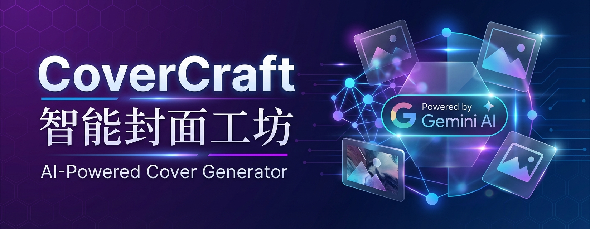

<div align="center">

</div>

[English](README.md) | [简体中文](README.zh-CN.md)

# 智能封面工坊 (CoverCraft)

一个基于 Google Gemini AI 的智能封面生成工具，帮助你快速创建精美的视频封面、社交媒体图片和各类设计素材。

## ✨ 主要特性

- 🤖 **AI 驱动** - 使用 Google Gemini 强大的 AI 能力生成创意封面
- 🎨 **智能设计** - 自动理解你的需求，生成专业级设计
- ⚡ **快速高效** - 几秒钟内即可获得多个设计方案
- 🎯 **精准定制** - 支持自定义风格、颜色和元素
- 📱 **响应式界面** - 完美适配各种设备和屏幕尺寸

## 🚀 快速开始

本项目包含了在本地运行应用所需的一切。

在 AI Studio 中查看你的应用: https://ai.studio/apps/drive/1M-ZvAT24D02VUeZhxKfiXlZq5YckRpzK

## 本地运行

**前置要求：** Node.js


1. 安装依赖：
   `npm install`
2. 在 [.env.local](.env.local) 中设置你的 Gemini API 密钥 `GEMINI_API_KEY`
3. 运行应用：
   `npm run dev`

## 部署到生产环境


### 快速部署

```bash
# 构建生产版本
npm run build

# 预览构建结果
npm run preview
```

构建完成后，`dist` 目录包含了所有可以部署的静态文件。

### 部署平台

本项目支持部署到多个平台：

- **Vercel**（推荐）- 零配置部署
- **Netlify** - 简单快速
- **GitHub Pages** - 免费托管
- **Nginx/Apache** - 自建服务器
- **Docker** - 容器化部署
- **宝塔面板** - 可视化管理

📖 **详细部署指南请查看：[DEPLOYMENT.md](DEPLOYMENT.md)**

> ⚠️ **安全提示**：生产环境建议使用后端 API 代理来保护 Gemini API 密钥，避免直接在前端暴露。详见部署文档。
